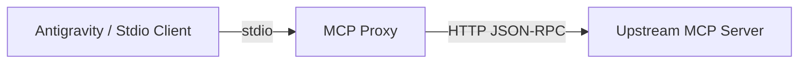

# MCP HTTP-stdio Proxy

A Node.js implementation of a Model Context Protocol (MCP) proxy that enables communication between **stdio-based** clients (like Antigravity) and **HTTP-based** MCP servers (running with `streamableHttp`).

## Overview

This proxy allows you to use remote or HTTP-hosted MCP servers as if they were local stdio servers. It handles the JSON-RPC communication, session management, and optional authentication seamlessly.



## Features

- **Protocol Translation:** Bridges MCP over stdio to MCP over HTTP.
- **Session Management:** 
    - Automatically handles upstream initialization.
    - Persists session IDs in `~/.mcp-session-cache` for continuity.
    - Automatic retries on session expiration or "Not Initialized" errors.
- **Dynamic Tool List:** Automatically injects an `update` tool to manually refresh the upstream connection and clear the session cache.
- **Broad Support:** Proxies tools, resources, prompts, completions, and logging levels.
- **Authentication:** Supports optional authorization headers for secure upstream servers.
- **Timeout Support:** Configurable request timeouts.

## Installation

1. Clone or copy the project files.
2. Install dependencies:
   ```bash
   npm install
   ```

## Configuration

The proxy can be configured using environment variables or a `.env` file:

| Variable | Description | Default |
|----------|-------------|---------|
| `UPSTREAM_MCP_URL` | The URL of the target HTTP MCP server. | `http://localhost:8080/mcp` |
| `UPSTREAM_AUTH` | Optional authentication header value (e.g., `Bearer ...`). | (none) |
| `MCP_TIMEOUT_MS` | Timeout for upstream requests in milliseconds. | `15000` |
| `MCP_SESSION_ID` | Manually specify an initial session ID. | (none) |

## Usage

### Direct Execution
You can run the proxy directly and optionally pass the upstream URL as the first argument:

```bash
node mcp-proxy.js https://your-remote-mcp-server.com/mcp
```

### Integration with Antigravity
To use this proxy with Antigravity, add it to your `mcp_config.json` (or similar configuration):

```json
{
  "mcpServers": {
    "my-remote-server": {
      "command": "node",
      "args": ["/absolute/path/to/mcp-proxy.js", "https://api.example.com/mcp"],
      "env": {
        "UPSTREAM_AUTH": "Bearer YOUR_TOKEN"
      }
    }
  }
}
```

## Custom 'update' Tool
The proxy automatically adds a tool named `update` to the list of available tools. Calling `update` will:
1. Clear the local session cache (`~/.mcp-session-cache`).
2. Force a re-initialization of the upstream server on the next request.
3. This is useful if the upstream server's tools have changed or the session has become desynchronized.

## License
ISC
